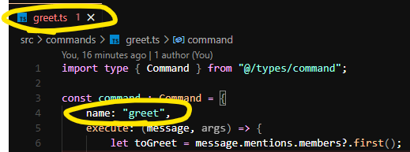

# Discord Starter Bot

A starter template for a Discord bot using Bun, with built-in support for both slash and prefix commands.

## Getting Started

### Prerequisites
- [Bun.sh](https://bun.sh/)
- A Discord Bot from [Discord developer portal](https://discord.com/developers/applications)

### Installation and configuration
1. Install dependencies:
    ```bash
    bun install
    ```

2. Rename `.env.example` to `.env`, and add your bot credentials from the Discord Developer Portal:
    ```bash
    DISCORD_TOKEN=your_token
    DISCORD_CLIENT_ID=your_client_id
    DISCORD_CLIENT_SECRET=your_client_secret
    ```
3. Customize the bot configuration in config.json for command prefix and embed settings.

4. **❗ Important: When adding prefix commands in `src/commands/**`, ensure the filename and `Command.name` match.**

    

### Running the Bot
Run the bot with:
```bash
bun start
```

## Project Structure
- `src/**` - Main source code
    - `slash-commands/**` - All slash commands
    - `commands/**` - All prefix commands
- `config.json` - Bot configuration settings
- `.env.example` - Template for environment variables (rename to `.env`)
